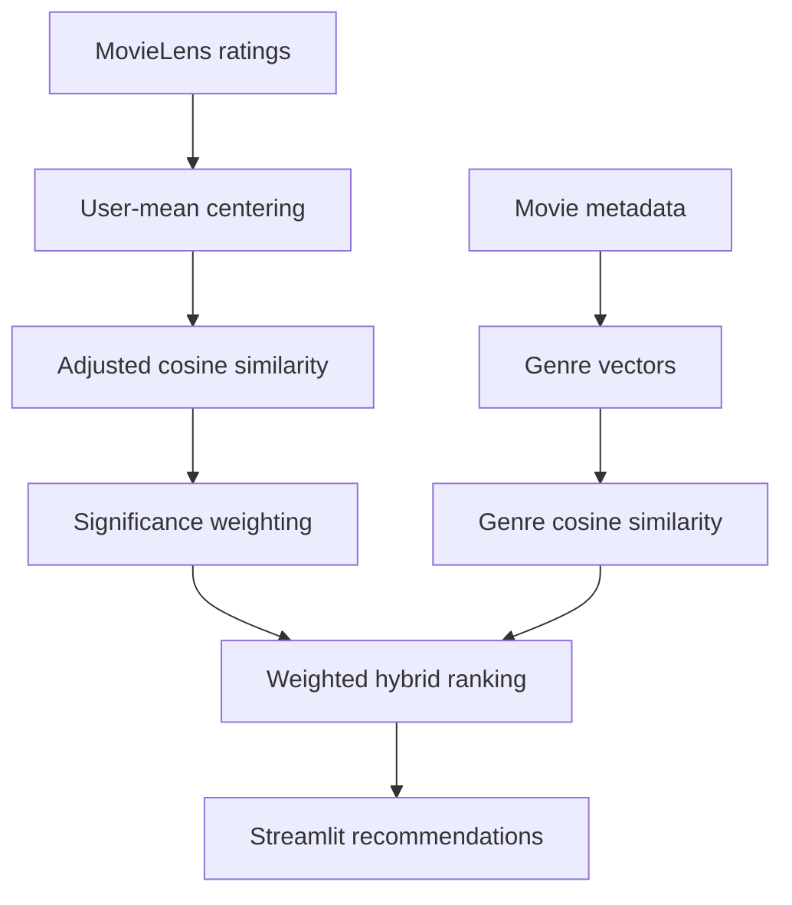

<div align="center">

# 🎬 ReelMatch

### Explainable hybrid movie recommendations from real audience behaviour

[](https://github.com/Anas-S-Muhammed/movie-recommender/actions/workflows/ci.yml)
[](https://www.python.org/)
[](https://streamlit.io/)
[](LICENSE)

Select up to five movies you enjoy. ReelMatch combines collaborative filtering with genre similarity to build a transparent taste profile and rank relevant films from MovieLens 100K.

</div>

---

## Why this project exists

Most introductory recommenders fill missing ratings with zero and rank movies from a single title. That approach is easy to demonstrate, but it treats “not rated” as “disliked,” amplifies popularity bias and produces unstable similarities from small samples.

ReelMatch is a production-minded evolution of that baseline. It separates model code from the interface, corrects for individual rating habits, reduces low-evidence matches, supports multiple seed movies, adds reproducible offline evaluation and ships with tests, CI and container support.

## What it does

- Builds a preference profile from **one to five movies** selected by the user.
- Uses **adjusted-cosine item similarity** to correct for generous and strict raters.
- Applies **significance weighting** so a match supported by only a few shared viewers is discounted.
- Blends collaborative evidence with **19 MovieLens genre signals**.
- Filters movies by minimum rating count to control recommendation reliability.
- Shows the release year, genres, average audience rating, rating count and match score.
- Caches the fitted model so Streamlit reruns remain responsive.
- Keeps recommendation logic in a reusable, independently tested Python package.

## System design



### Ranking formula

For a candidate movie, ReelMatch averages its similarity to every selected seed movie and combines the two signals:

```text
final_score = α × collaborative_score + (1 − α) × genre_score
```

The interface exposes `α` as the **Audience-taste weight**. The default is `0.85`, prioritising behavioural evidence while retaining a small content signal. Collaborative similarity is further multiplied by:

```text
co_raters / (co_raters + shrinkage)
```

This prevents a near-perfect score based on only one or two shared raters from dominating the ranking.

## Quick start

### Requirements

- Python 3.10–3.13
- Git

### Run locally

```bash
git clone https://github.com/Anas-S-Muhammed/movie-recommender.git
cd movie-recommender

python -m venv .venv
```

Activate the environment:

```bash
# macOS / Linux
source .venv/bin/activate

# Windows PowerShell
.venv\Scripts\Activate.ps1
```

Install and launch:

```bash
pip install -r requirements.txt
streamlit run app.py
```

Open `http://localhost:8501` if Streamlit does not open it automatically.

## Run with Docker

```bash
docker build -t reelmatch .
docker run --rm -p 8501:8501 reelmatch
```

The container includes a health check at Streamlit's `/_stcore/health` endpoint.

## Evaluation

The repository includes a seeded leave-one-out evaluation. It removes one positively rated movie from each sampled user's history, fits on the remaining ratings, creates a profile from that user's other positive ratings and checks whether the hidden title appears in the top `K` results.

```bash
python scripts/evaluate.py --users 1000 --k 10 --seed 42
```

Reference result on the committed MovieLens data and default model settings:

| Metric | Result |
|---|---:|
| Evaluated users | 942 |
| Hit Rate@10 | 0.1136 |
| Mean Reciprocal Rank | 0.0433 |

These numbers are a reproducible baseline, not a claim of state-of-the-art performance. The evaluation searches the full eligible catalogue and is deliberately stricter than manually checking whether recommendations “look right.”

## Testing and code quality

Install development dependencies and run the same checks used by CI:

```bash
pip install -r requirements-dev.txt
ruff check .
pytest
```

GitHub Actions runs linting and tests on Python 3.11 and 3.12 for every pull request and every push to `main`.

## Project structure

```text
movie-recommender/
├── .github/workflows/ci.yml       # Automated linting and tests
├── .streamlit/config.toml         # Application theme and server config
├── data/
│   ├── u.data                     # 100,000 user–movie ratings
│   └── u.item                     # Movie titles and genre metadata
├── notebooks/
│   └── movie_recommender.ipynb    # Original exploratory analysis
├── scripts/
│   └── evaluate.py                # Reproducible ranking evaluation
├── src/movie_recommender/
│   ├── __init__.py
│   └── engine.py                  # Loading, fitting and recommendation logic
├── tests/
│   └── test_engine.py             # Unit tests for core behaviour
├── app.py                         # Streamlit interface
├── Dockerfile
├── requirements.txt
└── pyproject.toml
```

## Dataset

[MovieLens 100K](https://grouplens.org/datasets/movielens/100k/) contains 100,000 ratings from 943 users across 1,682 movies. Ratings use a 1–5 scale, and every user rated at least 20 films.

The dataset is useful for reproducible research and portfolio work, but its catalogue is historical. It does not contain current releases, streaming availability, plot embeddings, cast data or modern user behaviour.

The dataset has its own usage conditions and is not covered by this project's MIT licence. See [DATA_LICENSE.md](DATA_LICENSE.md) before redistributing it.

## Current limitations

- **Historical catalogue:** MovieLens 100K cannot recommend recent releases.
- **Item cold start:** A new movie needs rating or genre metadata before it can be ranked meaningfully.
- **Session-only preference:** The app builds a profile from selected movies and does not persist user accounts or feedback.
- **Dense similarity matrices:** The current approach is appropriate for 1,682 titles but would need sparse or approximate-nearest-neighbour infrastructure for a large commercial catalogue.
- **Offline metrics only:** Hit Rate and MRR do not measure long-term satisfaction, novelty, diversity or business impact.

## Roadmap

- Add diversity-aware re-ranking to reduce near-duplicate recommendations.
- Compare the hybrid baseline with matrix factorisation and implicit-feedback models.
- Add coverage, novelty and NDCG to the evaluation suite.
- Retrieve current movie metadata and artwork from an external API.
- Package the engine behind a small REST API for non-Streamlit clients.
- Track experiments and model parameters with a reproducible configuration layer.

## Contributing

Issues and pull requests are welcome. Read [CONTRIBUTING.md](CONTRIBUTING.md) before making a substantial change. Algorithm changes should include tests and before/after evaluation metrics.

## Licence

The source code is available under the [MIT License](LICENSE). MovieLens data remains subject to the separate GroupLens terms described in [DATA_LICENSE.md](DATA_LICENSE.md).

---

<div align="center">
Built by <a href="https://github.com/Anas-S-Muhammed">Anas Muhammed</a> with Python, pandas, scikit-learn and Streamlit.
</div>
