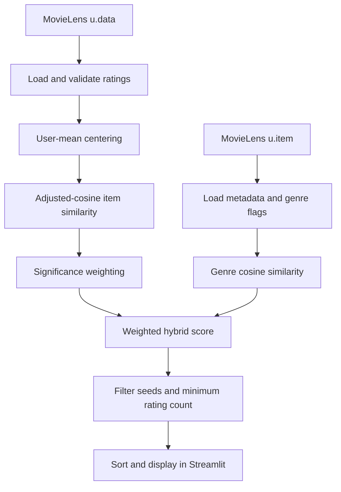

# ReelMatch — Explainable Hybrid Movie Recommendations

[](https://github.com/Anas-S-Muhammed/movie-recommender/actions/workflows/ci.yml) [](https://www.python.org/) [](https://streamlit.io/) [](LICENSE)

ReelMatch is a **hybrid, item-based movie recommender** that turns one to five movies a user already enjoys into ranked, explainable suggestions. It combines audience-rating behavior with genre similarity, discounts similarities supported by few co-raters, and exposes the result through a Streamlit application.

## Value proposition

Many introductory recommenders treat an unrated movie as a zero rating or make a recommendation from one seed title. ReelMatch instead centers ratings by each user's mean, supports multiple seed movies, and blends collaborative evidence with content metadata. The repository demonstrates a complete path from local dataset files to an interactive application, reusable model package, tests, CI, Docker packaging, and reproducible offline evaluation.

## Overview

The application loads the committed MovieLens 100K ratings and movie metadata, fits a recommendation model, and displays dataset-level metrics. Users choose movies by title, then control the number of results, the balance between audience behavior and genres, and the minimum number of ratings required for a candidate. Results include title, release year, genres, average rating, rating count, and match score.

Recommendation logic lives in `src/movie_recommender/engine.py`, separately from the UI in `app.py`. Streamlit's `st.cache_resource` keeps the fitted model from being rebuilt on every rerun.

## Features

- Select **one to five movies** and generate ranked recommendations.
- Compute adjusted-cosine item similarity after centering ratings around each user's average.
- Apply significance weighting based on the number of shared raters.
- Blend collaborative similarity with cosine similarity over 19 genre indicators.
- Exclude selected seed movies and filter candidates by minimum rating count.
- Break ties using average rating and rating count after the recommendation score.
- Display recommendation evidence, including audience rating, rating count, genres, year, and match score.
- Validate core behavior with unit tests and a Streamlit `AppTest` integration test.
- Run linting and tests in GitHub Actions on Python 3.11 and 3.12.
- Run locally or in a Docker container on port `8501`.

## Recommendation workflow



For each candidate and the selected seed set, the implementation averages both similarity signals and combines them as:

```text
final_score = collaborative_weight × collaborative_score
            + (1 − collaborative_weight) × genre_score
```

The default collaborative weight is `0.85`. Collaborative similarity is also multiplied by `co_raters / (co_raters + shrinkage)`; the application fits with shrinkage `25`.

## Technology stack

| Area | Evidence in the repository |
|---|---|
| Language | Python `>=3.10,<3.14` |
| Data processing | pandas `2.2.3`, NumPy `2.1.3` |
| Similarity modeling | scikit-learn `1.6.1` cosine similarity |
| User interface | Streamlit `1.49.1` |
| Testing and quality | pytest `8.3.5`, Ruff `0.11.0` |
| Packaging and runtime | Docker, `python:3.12-slim`, GitHub Actions |

## Repository structure

```text
movie-recommender/
├── app.py                         # Streamlit interface and cached model creation
├── data/
│   ├── u.data                     # MovieLens user–movie ratings
│   └── u.item                     # Movie titles and genre indicators
├── notebooks/movie_recommender.ipynb # Earlier exploratory analysis
├── scripts/evaluate.py            # Seeded leave-one-out evaluation
├── src/movie_recommender/
│   ├── __init__.py
│   └── engine.py                  # Loading, fitting, and ranking logic
├── tests/                         # Engine and Streamlit tests
├── Dockerfile
├── pyproject.toml
├── requirements.txt
└── requirements-dev.txt
```

## Data source and scope

The repository includes the **MovieLens 100K** dataset from GroupLens Research [1]. The committed files contain 100,000 ratings from 943 users across 1,682 movies, with ratings on a 1–5 scale. The loader reads `u.data` as tab-separated ratings and `u.item` as pipe-separated metadata, then derives release years and readable genre strings.

This is a historical research dataset. The application does not provide current releases, streaming availability, plot embeddings, cast information, user accounts, or persistent feedback. The dataset has separate usage conditions and is not covered by this project's MIT license; see [`DATA_LICENSE.md`](DATA_LICENSE.md).

## Quick start

### Local Streamlit app

The project expects Python 3.10–3.13 and Git:

```bash
git clone https://github.com/Anas-S-Muhammed/movie-recommender.git
cd movie-recommender
python -m venv .venv
```

Activate the environment:

```bash
# macOS / Linux
source .venv/bin/activate

# Windows PowerShell
.venv\Scripts\Activate.ps1
```

Install runtime dependencies and start the app:

```bash
pip install -r requirements.txt
streamlit run app.py
```

Open [http://localhost:8501](http://localhost:8501) if Streamlit does not open it automatically. Select at least one movie and click **Find my movies**.

### Docker

```bash
docker build -t reelmatch .
docker run --rm -p 8501:8501 reelmatch
```

The image starts Streamlit on `0.0.0.0:8501` and defines a health check against `/_stcore/health`.

## Testing and evaluation

Install development dependencies and run the same checks used by CI:

```bash
pip install -r requirements-dev.txt
ruff check .
pytest
```

Tests cover ranking order, seed exclusion, duplicate seed handling, minimum-rating filtering, invalid requests, missing data files, application loading, and recommendation generation. GitHub Actions runs Ruff and pytest for Python 3.11 and 3.12 on pushes to `main` and pull requests.

The repository includes a seeded leave-one-out evaluation. It selects users with at least three positive ratings, hides one positive movie per sampled user, fits on the remaining ratings, and checks whether the hidden movie appears in the top `K` recommendations:

```bash
python scripts/evaluate.py --users 1000 --k 10 --seed 42
```

The committed baseline reports **942 evaluated users**, **Hit Rate@10 of 0.1136**, and **Mean Reciprocal Rank of 0.0433** for the MovieLens files and default settings. These are reproducible offline baseline metrics, not a state-of-the-art claim. They do not measure long-term satisfaction, novelty, diversity, coverage, or business impact.

## Current status and limitations

The project currently provides a functioning local Streamlit application backed by committed data, a reusable recommendation package, automated tests, CI configuration, Docker support, and an offline evaluation script. It is a portfolio-scale implementation rather than a production service.

Dense similarity matrices are appropriate for the 1,682-title catalog but would require sparse or approximate-nearest-neighbor techniques at larger scale. New movies have limited support without ratings or genre metadata. User preferences are session-only, the catalog is historical, and evaluation is offline.

## Future improvements

- Add diversity-aware re-ranking and coverage, novelty, and NDCG metrics.
- Compare this hybrid baseline with matrix-factorization and implicit-feedback models.
- Add current metadata and artwork through an external movie-data API.
- Expose the engine through a small REST API for non-Streamlit clients.
- Add a reproducible configuration and experiment-tracking layer.
- Introduce persistence and feedback if the application evolves beyond a session-only demo.

## Contributing and license

Contributions are welcome through focused pull requests. Keep recommendation logic in `src/movie_recommender/`, UI logic in `app.py`, and add or update tests for behavior changes. See [`CONTRIBUTING.md`](CONTRIBUTING.md) for the repository workflow.

Source code is available under the [MIT License](LICENSE). MovieLens data remains subject to the separate GroupLens terms described in [`DATA_LICENSE.md`](DATA_LICENSE.md).

## References

[1]: https://grouplens.org/datasets/movielens/100k/ "MovieLens 100K dataset"

Built by [Anas Muhammed](https://github.com/Anas-S-Muhammed).
